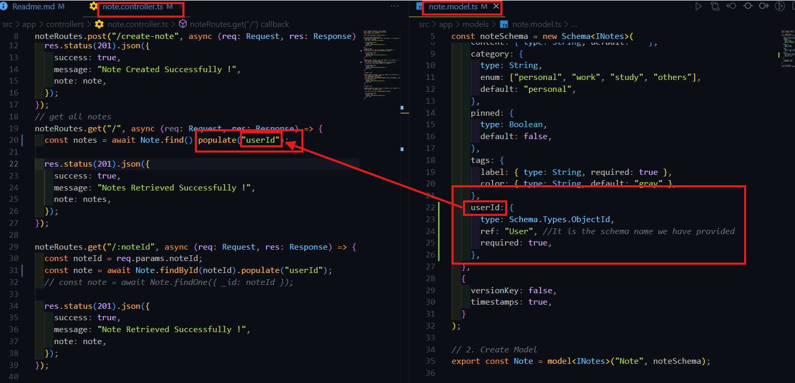

# Advanced-Mongoose-Validations-Methods-Middlewares-Virtuals-and-More

GitHub Link: https://github.com/Apollo-Level2-Web-Dev/advanced-note-app-with-mongoose/tree/module-7

## 18-1 Validations in Mongoose: Built-in and Custom validations [max/min]

[Validators](https://mongoosejs.com/docs/validation.html)

#### Builtin minLength and maxLength, min and max, lowercase, uppercase, unique validator

```js
import { model, Schema } from "mongoose";
import { IUser } from "../interfaces/user.interface";

const userSchema =
  new Schema() <
  IUser >
  {
    firstName: {
      type: String,
      required: true,
      trim: true,
      minlength: 3,
      maxlength: 10,
    },
    lastName: {
      type: String,
      required: true,
      trim: true,
      minlength: 3,
      maxlength: 10,
    },
    age: {
      type: Number,
      required: true,
      min: 18,
      max: 60,
    },
    email: {
      unique: true,
      type: String,
      required: true,
      trim: true,
    },
    password: {
      type: String,
      lowercase: true,
      required: true,
    },
    role: {
      type: String,
      uppercase: true,
      enum: ["USER", "ADMIN", "SUPERADMIN"],
      default: "USER",
    },
  };

export const User = model < IUser > ("User", userSchema);
```

#### Custom message validation error message.

```js
import { model, Schema } from "mongoose";
import { IUser } from "../interfaces/user.interface";

const userSchema =
  new Schema() <
  IUser >
  {
    firstName: {
      type: String,
      required: [true, "First name is required."],
      trim: true,
      minlength: [
        3,
        "First name must be at least 3 characters. Got '{VALUE}'.",
      ],
      maxlength: [
        10,
        "First name must not exceed 10 characters. Got '{VALUE}'.",
      ],
    },
    lastName: {
      type: String,
      required: [true, "Last name is required."],
      trim: true,
      minlength: [3, "Last name must be at least 3 characters. Got '{VALUE}'."],
      maxlength: [
        10,
        "Last name must not exceed 10 characters. Got '{VALUE}'.",
      ],
    },
    age: {
      type: Number,
      required: [true, "Age is required."],
      min: [18, "Age must be at least 18. Got {VALUE}."],
      max: [60, "Age must not exceed 60. Got {VALUE}."],
    },
    email: {
      type: String,
      required: [true, "Email is required."],
      trim: true,
      unique: [true, "Email must be unique. Email is already in use."],
      match: [/^\S+@\S+\.\S+$/, "Invalid email format. Got '{VALUE}'."],
    },
    password: {
      type: String,
      required: [true, "Password is required."],
      lowercase: true,
      minlength: [6, "Password must be at least 6 characters."],
    },
    role: {
      type: String,
      uppercase: true,
      enum: {
        values: ["USER", "ADMIN", "SUPERADMIN"],
        message: "'{VALUE}' is not a supported role.",
      },
      default: "USER",
    },
  };

export const User = model < IUser > ("User", userSchema);
```

#### Validation is like a middleware. It validates and if any error it do not allow to push the data to next stage.

## 18-2 More About Built-in validation, Making Custom Validations & Third party Validator Package

#### For mutation types we do no need to write validation error message.

#### Custom Validations

##### Validating Email using Builtin validator `match`

```js
  email: {
    type: String,
    required: [true, "Email is required."],
    trim: true,
    unique: [true, "Email must be unique. Email is already in use."],
    match: [/^\S+@\S+\.\S+$/, "Invalid email format. Got '{VALUE}'."],
  },
```

##### Validating Email using Custom Validator

```js
email: {
    type: String,
    required: [true, "Email is required."],
    trim: true,
    unique: [true, "Email must be unique. Email is already in use."],
    validate: {
      validator: function (value) {
        return /^\S+@\S+\.\S+$/.test(value);
      },
      message: function (props) {
        return `Email ${props.value} Is Not a Valid Email`;
      },
    },
  },
```

##### Validating Email using Third Party Validator

[Validator Js](https://www.npmjs.com/package/validator)

1.  Install the validator

```
npm i validator
```

2. Install The Types Library

```
npm i --save-dev @types/validator
```

```js
  email: {
    type: String,
    required: [true, "Email is required."],
    trim: true,
    unique: [true, "Email must be unique. Email is already in use."],
    validate: [validator.isEmail, "Provided Email Is Not Valid"],
  },
```

## 18-3 Validate using Zod

- In traditional validations, even if a type is specified, values of other types are often implicitly converted to the specified type. Zod solves this problem by enforcing strict type checking without automatic type coercion.
- Zod is a schema validation library. It validates only the schema.
- We have some data type. The way we are creating schema we will create zod validation schema.This validation layer will work over mongoose validation layer.

- When a use user sends a request It will be sent to zod. zod will validate the data inside body and then it will be send to mongoose validation layer. It increases safety and rush over mongoose as most of the validations will be done in ZOD.
- As Zod do not require to connect with database to validate so it will reduce the operation time.

- Zod do the validation ant the sanitization of the data first.

1. Install Zod

```
npm install zod
```

- user.controller.ts

```js
import { Request, Response } from "express";
import app from "../../app";
import express from "express";
import { User } from "../models/user.model";
import { z } from "zod";

export const usersRoutes = express.Router();

const createUserZodSchema = z.object({
  firstName: z.string(),
  lastName: z.string(),
  age: z.number(),
  email: z.string(),
  password: z.string(),
  role: z.string().optional(),
});
usersRoutes.post("/create-user", async (req: Request, res: Response) => {
  try {
    const body = await createUserZodSchema.parseAsync(req.body);

    console.log("Zod Body :", body);

    const user = await User.create(body);

    res.status(201).json({
      success: true,
      message: "Users Created Successfully !",
      user,
    });
  } catch (error: any) {
    console.log(error);
    res.status(400).json({
      success: false,
      message: error.message,
      error,
    });
  }
});
```

## 18-4 Embedding in Mongoose

- Data Can be stored in object or array of object
- This can be done using embedding as well.

[Embedding](https://mongoosejs.com/docs/2.7.x/docs/embedded-documents.html)

- Embedded document will have own schema and the schema will a part of other document.

#### Why embedding is needed?

```js
export interface IAddress {
  city: string;
  street: string;
  zip: number;
}
export interface IUser {
  firstName: string;
  lastName: string;
  age: number;
  email: string;
  password: string;
  role: "USER" | "ADMIN" | "SUPERADMIN";
  address: IAddress;
}
```

- If we define address interface like this this will not show error. if we add any new field in model or any erro happens in model, since model is not aware of the IAddress It Just know IUser.

<!-- without creating sub schema -->

```js
import { model, Schema } from "mongoose";
import { IUser } from "../interfaces/user.interface";
import validator from "validator";

const userSchema =
  new Schema() <
  IUser >
  {
    firstName: {
      type: String,
      required: [true, "First name is required."],
      trim: true,
      minlength: [
        3,
        "First name must be at least 3 characters. Got '{VALUE}'.",
      ],
      maxlength: [
        10,
        "First name must not exceed 10 characters. Got '{VALUE}'.",
      ],
    },
    lastName: {
      type: String,
      required: [true, "Last name is required."],
      trim: true,
      minlength: [3, "Last name must be at least 3 characters. Got '{VALUE}'."],
      maxlength: [
        10,
        "Last name must not exceed 10 characters. Got '{VALUE}'.",
      ],
    },
    age: {
      type: Number,
      required: [true, "Age is required."],
      min: [18, "Age must be at least 18. Got {VALUE}."],
      max: [60, "Age must not exceed 60. Got {VALUE}."],
    },
    email: {
      type: String,
      required: [true, "Email is required."],
      trim: true,
      unique: [true, "Email must be unique. Email is already in use."],
      validate: [validator.isEmail, "Provided Email Is Not Valid"],
    },
    password: {
      type: String,
      required: [true, "Password is required."],
      lowercase: true,
      minlength: [6, "Password must be at least 6 characters."],
    },
    role: {
      type: String,
      uppercase: true,
      enum: {
        values: ["USER", "ADMIN", "SUPERADMIN"],
        message: "'{VALUE}' is not a supported role.",
      },
      default: "USER",
    },
    address: {
      city: { type: String },
      street: { type: String },
      zip: { type: Number },
    },
  };

export const User = model < IUser > ("User", userSchema);
```

- so embedding is needed here to avoid this kind of safety. We need to create sub schema.

<!-- with sub schema -->

```js
import { model, Schema } from "mongoose";
import { IAddress, IUser } from "../interfaces/user.interface";
import validator from "validator";

// sub schema
const addressSchema =
  new Schema() <
  IAddress >
  ({
    city: { type: String },
    street: { type: String },
    zip: { type: Number },
  },
  {
    _id: false, // as it is a SUB SCHEMA we will turn off the _id so that automated mongodb id do not get inserted.
  });

// main schema
const userSchema =
  new Schema() <
  IUser >
  {
    firstName: {
      type: String,
      required: [true, "First name is required."],
      trim: true,
      minlength: [
        3,
        "First name must be at least 3 characters. Got '{VALUE}'.",
      ],
      maxlength: [
        10,
        "First name must not exceed 10 characters. Got '{VALUE}'.",
      ],
    },
    lastName: {
      type: String,
      required: [true, "Last name is required."],
      trim: true,
      minlength: [3, "Last name must be at least 3 characters. Got '{VALUE}'."],
      maxlength: [
        10,
        "Last name must not exceed 10 characters. Got '{VALUE}'.",
      ],
    },
    age: {
      type: Number,
      required: [true, "Age is required."],
      min: [18, "Age must be at least 18. Got {VALUE}."],
      max: [60, "Age must not exceed 60. Got {VALUE}."],
    },
    email: {
      type: String,
      required: [true, "Email is required."],
      trim: true,
      unique: [true, "Email must be unique. Email is already in use."],
      validate: [validator.isEmail, "Provided Email Is Not Valid"],
    },
    password: {
      type: String,
      required: [true, "Password is required."],
      lowercase: true,
      minlength: [6, "Password must be at least 6 characters."],
    },
    role: {
      type: String,
      uppercase: true,
      enum: {
        values: ["USER", "ADMIN", "SUPERADMIN"],
        message: "'{VALUE}' is not a supported role.",
      },
      default: "USER",
    },
    address: addressSchema, //using address sub schema here.
  };

export const User = model < IUser > ("User", userSchema);
```

## 18-5 Referencing and Population in Mongoose

- For Doing Referencing We will use mongodb ObjectId as it wi unique.
- Referencing is like we will just store the id and through the id we will find out the refereed data.


- Interface

```js
import { Types } from "mongoose";

export interface INotes {
  userId: Types.ObjectId;
}
```

- Model

```js
import { model, Schema } from "mongoose";
import { INotes } from "../interfaces/note.interface";

// 1. create schema
const noteSchema = new Schema<INotes>({
    userId: {
      type: Schema.Types.ObjectId,
      ref: "User", //It is the schema name we have provided
      required: true,
    },
  },
);

// 2. Create Model
export const Note = model<INotes>("Note", noteSchema);

```

### If We want to see the referenced data at a time we have to use populate

- controller

```js
import { Request, Response } from "express";
import { Note } from "../models/note.model";
import express from "express";

export const noteRoutes = express.Router();

// get all notes
noteRoutes.get("/", async (req: Request, res: Response) => {
  const notes = await Note.find().populate("userId");

  res.status(201).json({
    success: true,
    message: "Notes Retrieved Successfully !",
    note: notes,
  });
});

noteRoutes.get("/:noteId", async (req: Request, res: Response) => {
  const noteId = req.params.noteId;
  const note = await Note.findById(noteId).populate("userId");
  // const note = await Note.findOne({ _id: noteId });

  res.status(201).json({
    success: true,
    message: "Note Retrieved Successfully !",
    note: note,
  });
});
```



- This populate will show user data as well. As referenced it will fin the user id related data in the user collection and show the referenced data.
- Referencing will reduce the data redundancy. I mean data repetition.

## 18-6 Built-in and Custom Instance Methods in Mongoose

- Method we are using to create a user

```js
const user = await User.create(body);
```

- Another method of creating a user

```js
// another method of creating a user
const user = new User(body);

await user.save(); // here .save() function is a instance method
```

- Those are made based on User Model

```js
export const User = model < IUser > ("User", userSchema);
```

- This model is called builder or class
- Class is a blue print. using the blueprint when a building is made(object is created) then the building is called instance.


- Here Blueprint or object or instance is created using `new Schema`
- Here `model` is used to make a class or builder. I mean this will create a another instance/actual document(which will go to mongodb) based on the blueprint/object/instance

```js
export const User = model < IUser > ("User", userSchema);
```

- Here User is the builder.

```js
const user = new User(body); // here user is an instance of User class (instance itself is an object)
await user.save(); // this is built in instance method as we are calling .save() function from the instance
```

#### Lets see we can make custom make instance method

[Custom Instance Method](https://mongoosejs.com/docs/typescript/statics-and-methods.html)

- Lets Do with practical example

[bcrypt js](https://www.npmjs.com/package/bcryptjs)

1. Install Bcrypt

```
npm i bcryptjs
```

- hashing a password in controller

```js
import { Request, Response } from "express";
import bcrypt from "bcryptjs";
import express from "express";
import { User } from "../models/user.model";
import { z } from "zod";

export const usersRoutes = express.Router();

const createUserZodSchema = z.object({
  firstName: z.string(),
  lastName: z.string(),
  age: z.number(),
  email: z.string(),
  password: z.string(),
  role: z.string().optional(),
});
usersRoutes.post("/create-user", async (req: Request, res: Response) => {
  try {
    const zodBody = await createUserZodSchema.parseAsync(req.body);
    const body = req.body;

// hashing a password
    const password = await bcrypt.hash(body.password, 10);
    console.log(password);
    body.password = password;
// _______________________________________
    const user = new User(body);

    await user.save();

    res.status(201).json({
      success: true,
      message: "Users Created Successfully !",
      user,
    });
  } catch (error: any) {
    console.log(error);
    res.status(400).json({
      success: false,
      message: error.message,
      error,
    });
  }
});

```

#### We wil do it in a custom instance method since we might need it further more times.

## 18-7 More About Instance Method

- First create a interface

```js
export interface IAddress {
  city: string;
  street: string;
  zip: number;
}

export interface IUser {
  firstName: string;
  lastName: string;
  age: number;
  email: string;
  password: string;
  role: "USER" | "ADMIN" | "SUPERADMIN";
  address: IAddress;
}

// ✅ Add this for instance methods
export interface UserInstanceMethods {
  hashPassword(password: string): Promise<string>;
}
```

- We have some update in Schema Definition. Now we have to define 3 parameters inside schema. `new Schema<IUser, Model<IUser>, userInstanceMethods>`

- Before Introducing Custom Static Method

```js
import { model, Schema } from "mongoose";
import { IAddress, IUser } from "../interfaces/user.interface";
import validator from "validator";
import bcrypt from "bcryptjs";

// main schema
const userSchema =
  new Schema() <
  IUser >
  {
    // bla bla bla
  };

export const User = model < IUser > ("User", userSchema);
```

- After Introducing Static Method

```js
import { model, Schema } from "mongoose";
import { IAddress, IUser } from "../interfaces/user.interface";
import validator from "validator";

// main schema. NOW IT TAKES 3 PROPERTIES
const userSchema = new Schema<IUser, Model<IUser>, userInstanceMethods>
  {
    // bla bla bla
  };

  // creating a custom instance method for hashing password.
userSchema.method("hashPassword", async function (plainPassword: string) {
  const password = await bcrypt.hash(plainPassword, 10);
  return password;
});


// ✅ CORRECT: Tell TypeScript this model has instance methods
export const User = model<IUser, Model<IUser, {}, UserInstanceMethods>>("User",userSchema);
```

- User.Controller.ts

```js
import { Request, Response } from "express";
// import bcrypt from "bcryptjs";
import express from "express";
import { User } from "../models/user.model";
import { z } from "zod";

export const usersRoutes = express.Router();

const createUserZodSchema = z.object({
  firstName: z.string(),
  lastName: z.string(),
  age: z.number(),
  email: z.string(),
  password: z.string(),
  role: z.string().optional(),
});
usersRoutes.post("/create-user", async (req: Request, res: Response) => {
  try {
    const zodBody = await createUserZodSchema.parseAsync(req.body);
    const body = req.body;

    // const user = await User.create(body);

    // another method of creating a user
    const user = new User(body);


// hashing password using instance method
    const password = await user.hashPassword(body.password);
    console.log(password);

    user.password = password;

    await user.save();

    // here .save() function is a instance method

    res.status(201).json({
      success: true,
      message: "Users Created Successfully !",
      user,
    });
  } catch (error: any) {
    console.log(error);
    res.status(400).json({
      success: false,
      message: error.message,
      error,
    });
  }
});


```

#### Changes Required and Methods


